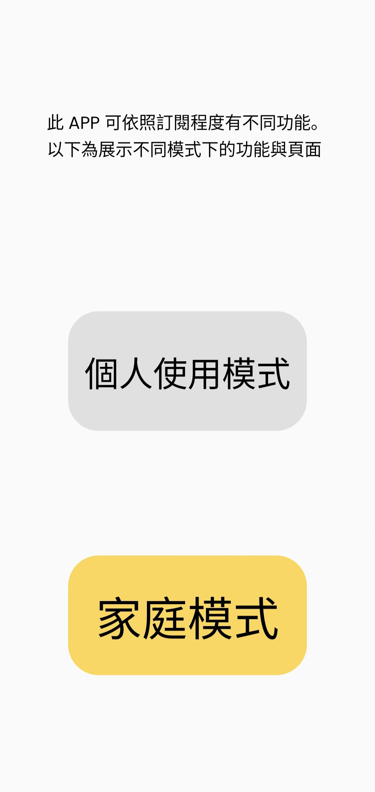
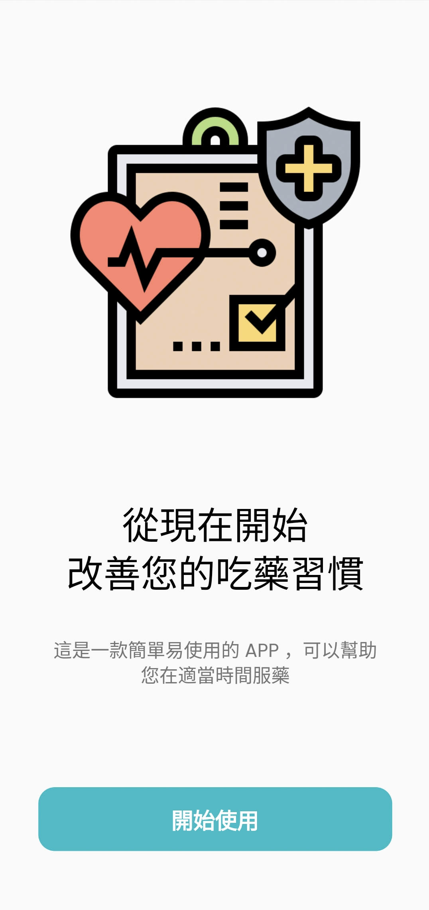
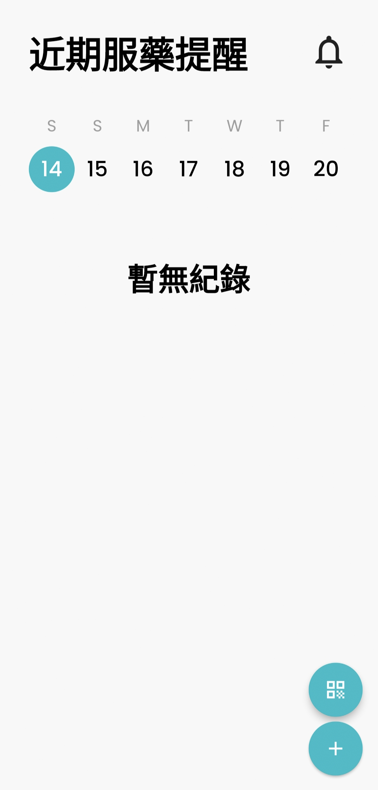
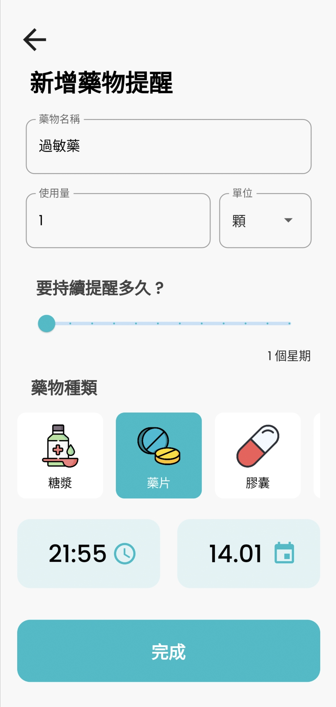
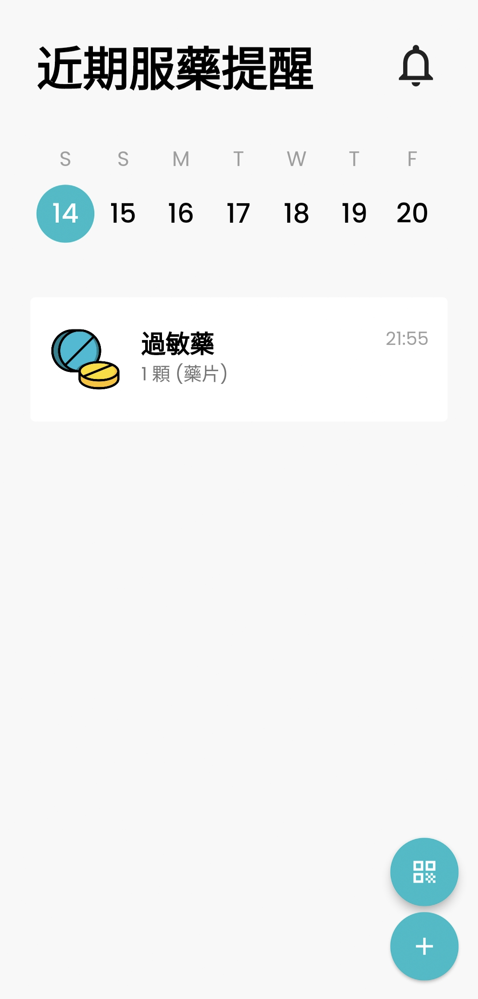
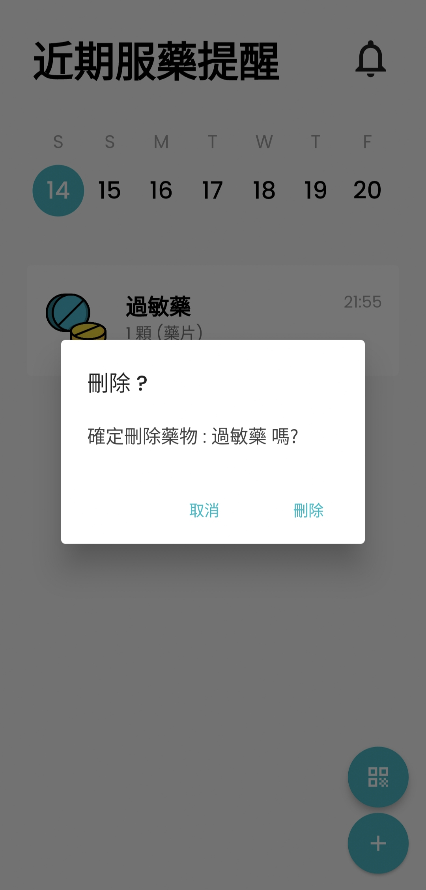
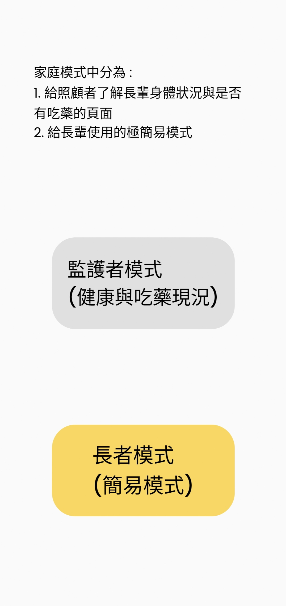
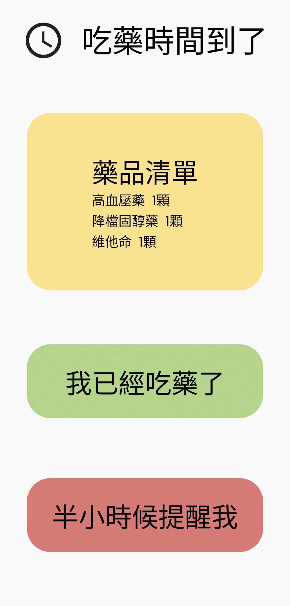
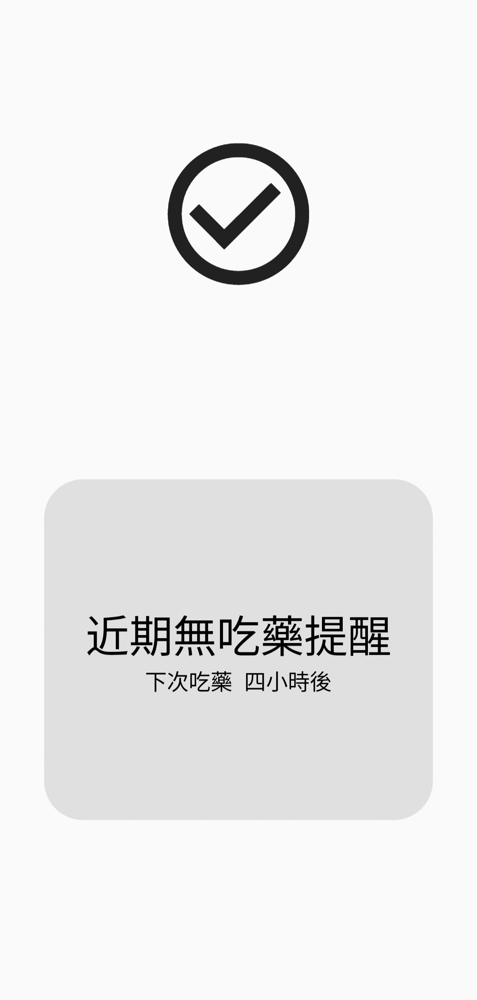
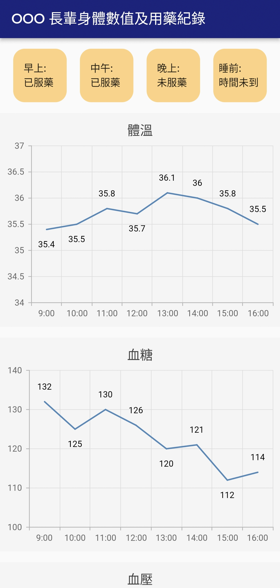

## **Medicines App**

#### A Flutter application, which you can save medicines and app will be send remind when you have to take it :bell:

Fork from https://github.com/gonciuu/Medicine-App-In-Flutter and have some changes.

#### New Screenshots

